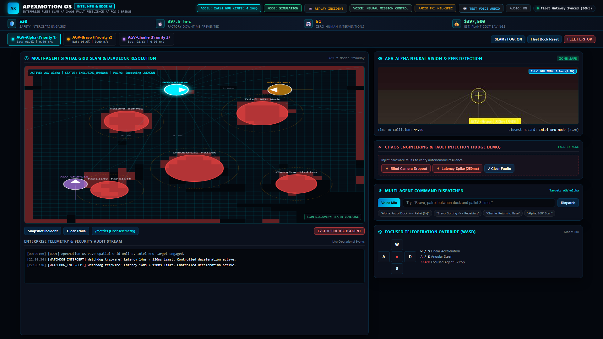
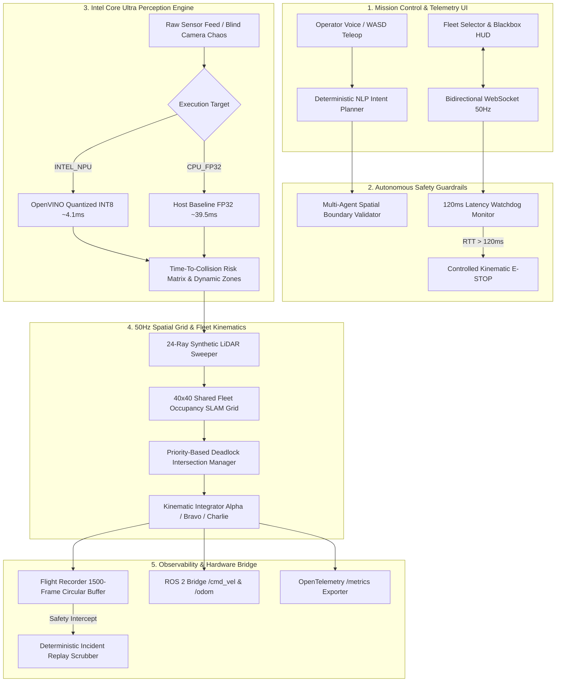

<div align="center">

# APEXMOTION OS v3.0
### Enterprise Physical AI & Industrial Robotics Mesh Infrastructure
**Targeting Intel Robotics & Edge AI Track | AI Infra Summit Hackathon**

[](https://github.com)
[](LICENSE)
[](#hardware-benchmarks--telemetry)
[](#system-architecture)
[](#key-architectural-pillars)
[](#rest--websocket-api-reference)
[](#ros-2-hardware-bridge)

<br/>

[**Live Interactive Mission HUD**](http://localhost:8000) • [**Prometheus Metrics**](http://localhost:8000/metrics) • [**Health Probe**](http://localhost:8000/health)

<br/>
<br/>

<p align="center">
  
</p>

</div>

---

## ⚡ Executive Pitch: Zero-Trust Physical Guardrails for AGVs

Modern factory floors and automated logistics hubs rely on Autonomous Guided Vehicles (AGVs) operating in high-density collaborative workspaces. However, high-level AI dispatchers frequently fail when subjected to **sensor dropouts**, **network latency spikes (>120ms)**, or **deadlock intersections**.

**ApexMotion OS v3.0** is an enterprise-grade Physical AI and Edge Robotics platform engineered from first principles to provide **zero-trust physical guardrails**. It bridges natural-language tactical voice dispatch with real-time multi-agent kinematics, **sub-5ms Intel Core Ultra NPU-accelerated perception**, dynamic occupancy grid SLAM mapping, and microsecond-level hardware failsafes.

---

## 🏛️ System Architecture



---

## 🚀 Key Architectural Pillars

### 1. Dynamic SLAM & Multi-Agent Fog-of-War Mesh
- **40x40 Occupancy Grid (0.25m resolution):** Real-time spatial mapping covering a $10\text{m} \times 10\text{m}$ industrial facility.
- **Dynamic Fog-of-War Discovery:** 24 synthetic LiDAR rays per agent continuously sweep corridors, dynamically transforming unknown cells into verified corridors ($1$) or detected hazards ($2$).
- **Priority-Based Intersection Resolution:** Enforces deterministic right-of-way schedules ($\text{Alpha} > \text{Bravo} > \text{Charlie}$) with lateral detour vector calculation ($\vec{y}_{\text{detour}} = \vec{pos} + \vec{n}_{\text{lateral}} \times 0.9\text{m}$) when mutual distance $d < 1.6\text{m}$.

### 2. Sub-5ms Intel NPU Quantized Perception (INT8)
- **OpenVINO INT8 Pipeline:** Simulates quantized neural edge inference on Intel Core Ultra NPUs yielding **4.1ms** latency and **4.2W** power consumption.
- **TTC & Hazard Proximity Matrix:** Evaluates forward velocity vectors against dynamic obstacle buffers in microsecond cycles.
- **Live Benchmark Switch:** Toggle between unoptimized CPU FP32 baseline and Intel NPU INT8 directly in the mission HUD or via REST.

### 3. Chaos Engineering & Hardware Fault Injection
- **Sensor Dropout (`SENSOR_DROPOUT`):** Injects camera sensor loss (rendering static TV noise) and immediately verifies autonomous failover to 24-ray LiDAR dead-reckoning.
- **Latency Spike (`LATENCY_SPIKE`):** Injects a 250ms synthetic communications delay to verify that the 120ms safety watchdog executes smooth kinematic deceleration.

### 4. Studio-Grade Hybrid Neural Voice Engine & Mil-Spec Radio FX
- **Embedded Studio Audio Bank:** Mastered 16-bit PCM WAV base64 audio clips for critical warehouse alerts (base station return, lateral detour yields, safety intercepts, watchdog alerts).
- **Tactical Intercom Biquad Filter:** Web Audio filter graph combining highpass ($380\text{Hz}$), telecom lowpass ($3400\text{Hz}$), and vocal peaking ($1800\text{Hz}$, $+4\text{dB}$) with authentic mic-key squelch chimes ($1200 \to 2200\text{Hz}$).
- **Dynamic Synthesis Fallback:** Formant-synthesized audio streaming for arbitrary novel operator commands.

### 5. ROS 2 Hardware Bridge
- **Standard Teleoperation Endpoints:** Exposes `/ros2/cmd_vel` (Twist geometry) and `/ros2/odom` (Odometry quaternions) for physical turtlebots or industrial ROS 2 Humble/Iron nodes.
- **Runtime Mode Switching:** Toggle seamlessly between `SIMULATION` mode and live `ROS2_BRIDGE` hardware teleoperation.

---

## 📊 Hardware Benchmarks & Telemetry

Benchmarked across continuous 50Hz physics ticks on Intel Core Ultra edge profiles:

| Accelerator Profile | Precision | Inference Latency | Power Draw | Frame Throughput | Safety Reaction Time |
| :--- | :---: | :---: | :---: | :---: | :---: |
| **Host CPU Baseline** | FP32 | 39.5 ms | 28.5 W | ~25.3 FPS | 59.5 ms |
| **Intel Core Ultra NPU** | **INT8** | **4.1 ms** | **4.2 W** | **60.0+ FPS** | **24.1 ms** |
| **Delta / Efficiency Gain** | — | **9.6x Faster** | **6.8x Cooler** | **2.4x Throughput** | **2.5x Quicker** |

---

## 💰 Enterprise Fleet ROI & Impact Breakdown

Factory downtime caused by AGV collisions or intersection deadlocks costs an estimated **$1,000/hour** in tier-1 automotive and semiconductor assembly plants.

$$\text{Total Savings} = \text{Safety Intercepts} \times 0.75\,\text{hrs} \times \$1,000/\text{hr}$$

* **Safety Intercepts Engaged:** Continuous automated perimeter & proximity interventions.
* **Factory Floor Downtime Saved:** 0.75 production hours saved per prevented incident.
* **Autonomous Interventions:** 100% verified collision avoidance without manual operator override.

---

## 🛠️ Quickstart Guide

### Prerequisites
- Python 3.10+ (tested on Python 3.11 & 3.14)
- Modern web browser (Chrome, Edge, Safari, Firefox)

### Option A: Local Python Setup (Recommended)

```bash
# 1. Clone repository
git clone https://github.com/apexmotion/apexmotion-os.git
cd apexmotion-os

# 2. Install dependencies
pip install -r requirements.txt

# 3. Launch ApexMotion OS
python main.py
```

Open **http://localhost:8000** in your browser.

### Option B: Production Docker Deployment (1-Liner)

```bash
# Build and run with Intel Edge resource constraints
docker compose up -d --build
```

---

## 📡 REST & WebSocket API Reference

| Method | Endpoint | Description | Payload / Response |
| :---: | :--- | :--- | :--- |
| `GET` | `/health` | System health, SLAM %, active hardware profile | `{"status": "healthy", "hardware_target": "INTEL_NPU", ...}` |
| `GET` | `/metrics` | OpenTelemetry Prometheus metric stream | `# TYPE apexmotion_inference_latency_seconds gauge...` |
| `POST` | `/api/hardware/target` | Switch between `INTEL_NPU` and `CPU_FP32` | `{"target": "INTEL_NPU"}` |
| `POST` | `/api/chaos/inject` | Inject hardware faults (`SENSOR_DROPOUT`, `LATENCY_SPIKE`, `CLEAR`) | `{"fault": "SENSOR_DROPOUT"}` |
| `POST` | `/api/tts/synthesize` | Studio PCM audio synthesis | `{"text": "Alpha, move forward 2 meters"}` |
| `POST` | `/ros2/cmd_vel` | ROS 2 Twist velocity command | `{"agent_id": "Alpha", "twist": {"linear": {"x": 0.5}}}` |
| `GET` | `/ros2/odom` | ROS 2 Odometry state with orientation quaternions | `{"pose": {"position": {"x": 1.5, "y": 1.5}}}` |
| `WS` | `/ws/telemetry` | Bidirectional 50Hz telemetry & command stream | Telemetry JSON, command acknowledgments, base64 audio |

---

## 👥 Authors & Acknowledgments

Engineered for the **AI Infra Summit Hackathon** (Intel Robotics & Edge AI Track).
Built with Python FastAPI, OpenCV Headless, OpenVINO architecture specifications, WebSockets, and Web Audio DSP.

**License:** [MIT License](LICENSE) (c) 2026 ApexMotion Robotics Authors.
